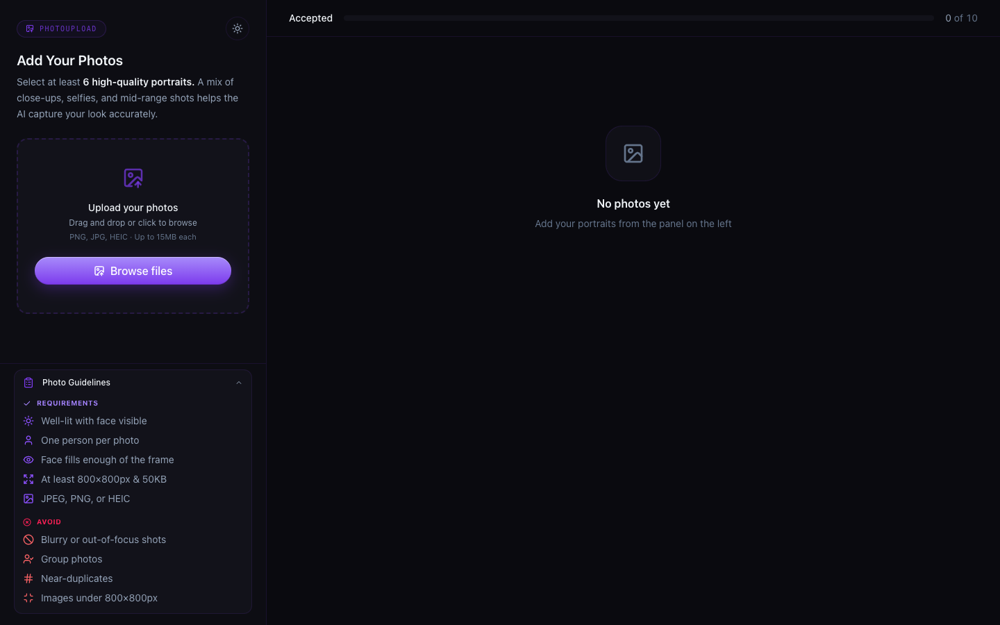
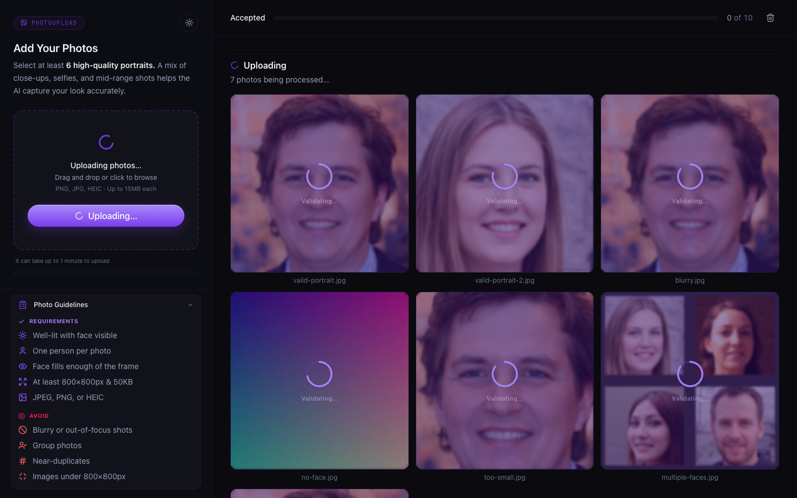
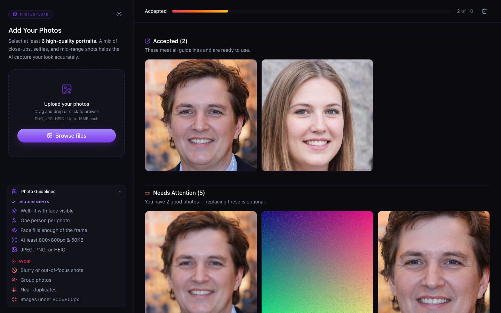
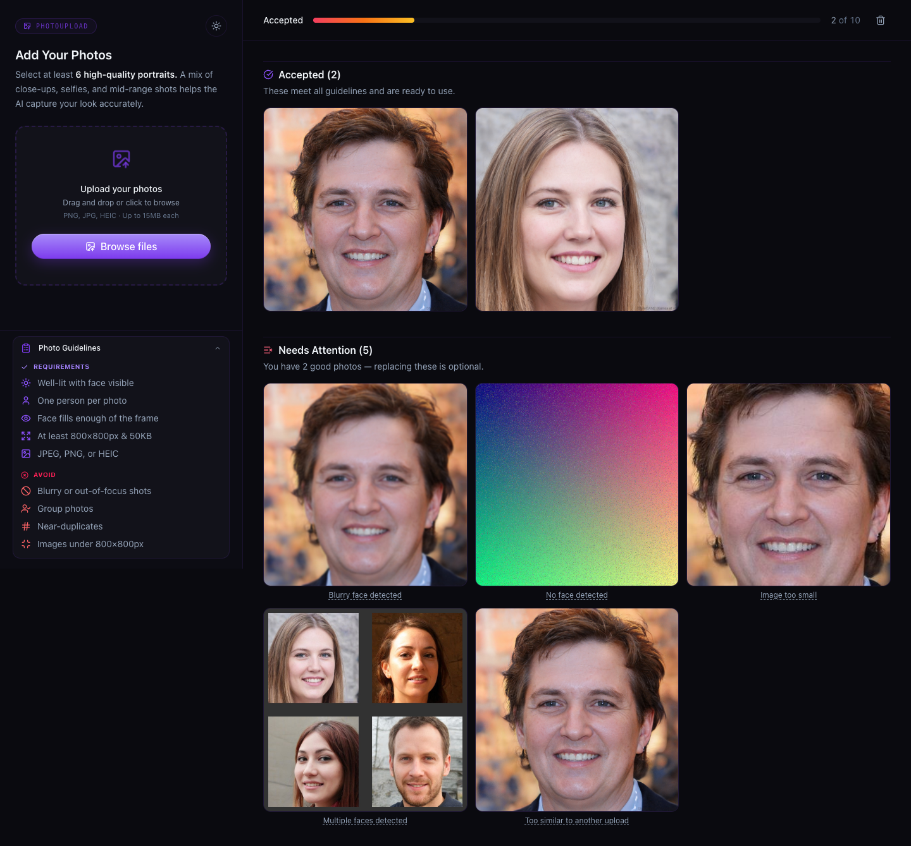
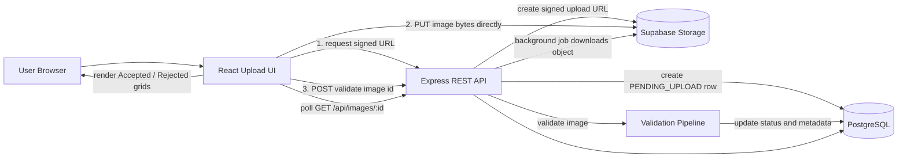
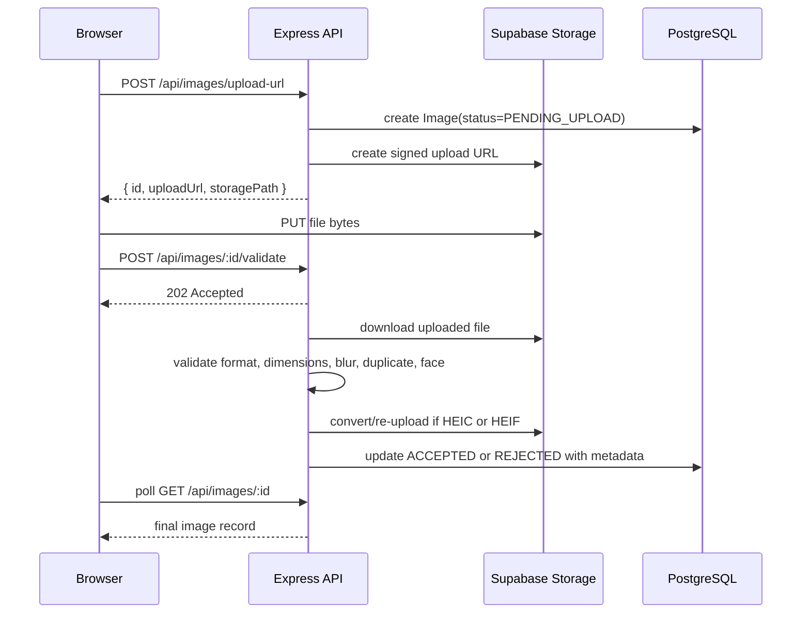

# Aragon AI Image Upload Validation

Full-stack image upload flow for the Aragon.ai Round 1 interview. Users can upload portrait photos, see live progress, and get each image categorized as `ACCEPTED` or `REJECTED` based on image quality and face validation rules.

The implementation is intentionally close to the assignment brief: React on the frontend, Node/Express on the backend, Prisma/PostgreSQL for metadata, Supabase Storage as the S3-compatible storage layer, and an asynchronous validation pipeline for image processing.

## Feature Summary

- Drag-and-drop or file-picker image upload.
- Frontend file validation for JPEG, PNG, HEIC, and HEIF.
- Per-file status feedback: preparing, uploading, validating, accepted, rejected, or failed.
- Local previews while images are uploading.
- Accepted and Rejected image sections with persisted results.
- Rejection labels and tooltips for validation failures.
- Direct-to-storage upload through signed Supabase Storage URLs.
- Background validation with client polling.
- HEIC/HEIF conversion to JPEG before downstream validation.
- Prisma-backed PostgreSQL schema with status and hash indexes.

## Tech Stack

| Area | Technology | Notes |
| --- | --- | --- |
| Frontend | Vite, React, TypeScript | Fast local development and typed UI |
| UI state | React hooks | Local upload state per file |
| Server state | TanStack Query | Fetches accepted/rejected lists and updates cache |
| Styling | Tailwind CSS | Responsive upload interface |
| Backend | Node.js, Express, TypeScript | REST API |
| ORM | Prisma | PostgreSQL schema and typed DB access |
| Database | PostgreSQL, Supabase | Stores image metadata, status, dimensions, hashes |
| Storage | Supabase Storage | S3-equivalent object storage with signed upload URLs |
| Image processing | sharp, heic-convert | Metadata, blur, hash, HEIC conversion |
| Face detection | @vladmandic/face-api, tfjs-node | Single-face, multiple-face, and face-size checks |
| Validation | file-type, Zod | Magic-byte file validation and request validation |

## Screenshots

| State | Preview |
|-------|---------|
| **Empty state** — clean dropzone with photo guidelines sidebar |  |
| **Sidebar** — requirements and restrictions sections expanded |  |
| **Upload in progress** — files being prepared, uploaded, and validated with per-file status indicators |  |
| **After validation** — full page showing accepted and rejected grids |  |
| **Accepted / Rejected sections** — viewport with rejection tooltip on hover |  |
| **Dark mode** — same results in dark theme |  |

## Architecture



### Key Architectural Principles

1. **Direct-to-storage upload** — The server never buffers upload bytes. It issues a signed upload URL (`server/src/lib/supabase.ts:18`), the browser uploads directly to Supabase Storage (`client/src/lib/api.ts:56`), and the server later downloads the stored object once for validation. This keeps upload memory pressure low on the API process.

2. **Async validation with polling** — `POST /:id/validate` returns 202 immediately (`server/src/routes/images.ts:175`). The client polls `GET /:id` every 2 seconds until status leaves `PENDING_UPLOAD` (`client/src/components/UploadDropzone.tsx:55`). No WebSockets or SSE — simpler infrastructure.

3. **Pipeline stages** — Format first (magic bytes), then HEIC conversion if needed, then dimensions, then blur + duplicate in parallel, then face detection (skipped if already rejected). See `server/src/validators/index.ts:16` and `server/src/routes/images.ts:76`.

4. **No service layer** — Route handler calls Prisma directly. No repository pattern, no response envelopes. Two layers max. (`server/src/routes/images.ts`)

5. **Zod at route boundary only** — Request validation with Zod at each route, nowhere else in the stack. (`server/src/schemas.ts`)

6. **Fire-and-forget with error boundary** — Validation runs in `runValidationPipelineSafe` which catches all errors and marks the image as `PROCESSING_FAILED` (`server/src/routes/images.ts:162`). The server never crashes from a bad image.

## Upload Lifecycle



## Validation Pipeline

The validation logic lives in `server/src/validators`. Results are stored as a `RejectionReason[]` on the image row, so a single image can carry multiple rejection reasons where applicable.

### Pipeline Execution Order

```
buffer → validateFormat → HEIC→JPEG conversion → validateDimensions → {validateBlur, validateDuplicate} in parallel → validateFace (skipped if already rejected)
```

See `server/src/routes/images.ts:76` for the orchestration and `server/src/validators/index.ts:16` for the parallel stage.

### Validator Breakdown

| Requirement | Reason | Implementation | File | Technical Detail |
| --- | --- | --- | --- | --- |
| Reject small files or resolution | `TOO_SMALL` | `sharp(buffer).metadata()` | `validators/dimensions.ts` | Checks both dimensions (≥800px each side) and file size (≥50KB). Returns metadata even on rejection so the UI can show resolution info. |
| Reject non-JPG/PNG/HEIC files | `INVALID_FORMAT` | `file-type` magic-byte inspection | `validators/format.ts` | Reads the actual file signature bytes, not the extension. A renamed `.txt → .jpg` is caught here. The uploaded storage object is deleted immediately on rejection to avoid storing garbage. |
| Reject similar existing images | `DUPLICATE` | 8×8 average hash + Hamming distance | `validators/duplicate.ts` | Resizes to 8×8, converts to greyscale, computes the mean, and produces a 64-bit hash. Compares against latest 1,000 hashes. An in-flight `Set<string>` prevents same-batch duplicates from both passing (JS single-threaded guarantee makes has+add atomic). |
| Reject blurry images | `BLURRY` | Laplacian variance | `validators/blur.ts` | Resizes to 256×256 greyscale first (O(65k) pixels vs O(millions) on full-res), then applies the Laplacian kernel `[0,1,0 / 1,-4,1 / 0,1,0]` and computes variance. Threshold of 200 was calibrated against a test set of sharp/blurry portraits. |
| Reject face too small | `FACE_TOO_SMALL` | TinyFaceDetector bounding box | `validators/face.ts` | After face detection, computes the largest face box area ÷ total image area. If ratio < 5%, rejected. |
| Reject multiple faces | `MULTIPLE_FACES` | TinyFaceDetector count | `validators/face.ts` | If `detectAllFaces` returns > 1 detection, immediately rejected. |
| Extra guard | `NO_FACE` | TinyFaceDetector | `validators/face.ts` | If 0 faces detected, rejected. |
| Fallback | `PROCESSING_FAILED` | catch-all | `routes/images.ts:165` | If the entire pipeline throws unexpectedly, the image is marked as failed so the client doesn't poll forever. |

### Current Thresholds

| Threshold | Value | Why |
|-----------|-------|-----|
| Minimum width | 800px | Portrait headshots are typically ≥1024px |
| Minimum height | 800px | Same as width |
| Minimum file size | 50 KB | A real 800×800 JPEG is usually >50KB |
| Maximum frontend upload | 15 MB | Balances user experience with server memory |
| Blur (Laplacian variance) | < 200 | Calibrated with known blurry/sharp test set |
| Duplicate (Hamming distance) | ≤ 5 | 10 caused false positives on different group photos |
| Face-to-image area ratio | ≥ 5% | Ensures the face fills enough of the frame |

### HEIC/HEIF Handling

HEIC and HEIF files are accepted, converted to JPEG with `heic-convert` (quality 0.9), re-uploaded to storage, the original HEIC is deleted from storage, and downstream validation runs on the JPEG. See `server/src/routes/images.ts:108`.

### Concurrency Control

Validation concurrency is capped at 4 images globally using `p-limit` (`server/src/validators/index.ts:14`). On a 512MB server this prevents OOM from multiple simultaneous sharp/face-api processes. The `sharp` cache is also disabled and concurrency limited to 1 (`server/src/index.ts:10-11`).

### Face Detection Model Choice

TinyFaceDetector (0.18 MB model) was chosen over SsdMobilenetv1 (5.4 MB) — 30× smaller and ~5× faster with acceptable accuracy for headshot portraits. See `server/src/lib/faceModel.ts:14`. The model is loaded once at server startup and reused.

## API Overview

Base URL in development: `http://localhost:3000`

### `POST /api/images/upload-url`

Creates a `PENDING_UPLOAD` row and returns a signed object-storage upload URL.

Request:

```json
{
  "filename": "portrait.jpg",
  "mimeType": "image/jpeg"
}
```

Response:

```json
{
  "id": "clx...",
  "storagePath": "uuid.jpg",
  "uploadUrl": "https://..."
}
```

### `PUT <uploadUrl>`

The browser uploads the raw file directly to Supabase Storage. This request bypasses the Express server.

### `POST /api/images/:id/validate`

Starts background validation and returns immediately.

Response:

```json
{
  "id": "clx...",
  "status": "PENDING_UPLOAD"
}
```

### `GET /api/images/:id`

Fetches a single image record. The frontend polls this endpoint until the image is no longer `PENDING_UPLOAD`.

### `GET /api/images?status=ACCEPTED&limit=50&cursor=<id>`

Lists stored images. `status` is optional. Cursor pagination is supported with `limit` capped at 100.

Response:

```json
{
  "items": [
    {
      "id": "clx...",
      "filename": "portrait.jpg",
      "publicUrl": "https://...",
      "status": "REJECTED",
      "rejectionReasons": ["BLURRY"],
      "width": 1200,
      "height": 1600,
      "fileSize": 421000,
      "mimeType": "image/jpeg",
      "createdAt": "2026-05-24T12:00:00.000Z"
    }
  ],
  "nextCursor": null
}
```

### `DELETE /api/images/:id`

Deletes one image row and its storage object.

### `DELETE /api/images`

Bulk deletes image rows and storage objects.

Request:

```json
{
  "ids": ["clx...", "cly..."]
}
```

## Data Model

```prisma
enum ImageStatus {
  PENDING_UPLOAD
  ACCEPTED
  REJECTED
}

enum RejectionReason {
  TOO_SMALL
  INVALID_FORMAT
  DUPLICATE
  BLURRY
  FACE_TOO_SMALL
  MULTIPLE_FACES
  NO_FACE
  PROCESSING_FAILED
}

model Image {
  id               String            @id @default(cuid())
  filename         String
  storagePath      String            @unique
  publicUrl        String
  status           ImageStatus       @default(PENDING_UPLOAD)
  rejectionReasons RejectionReason[]
  fileSize         Int?
  width            Int?
  height           Int?
  mimeType         String?
  pHash            String?
  createdAt        DateTime          @default(now())
  updatedAt        DateTime          @updatedAt

  @@index([status])
  @@index([createdAt(sort: Desc)])
  @@index([pHash])
}
```

The schema is intentionally compact. The UI needs one row per image, and rejection reasons are stored as a PostgreSQL enum array to avoid a join table for this scope.

## Repository Structure

```text
.
|-- client/
|   |-- src/
|   |   |-- components/
|   |   |   |-- AcceptedGrid.tsx
|   |   |   |-- FileListItem.tsx
|   |   |   |-- ImageCard.tsx
|   |   |   |-- RejectedGrid.tsx
|   |   |   |-- SessionGrid.tsx
|   |   |   `-- UploadDropzone.tsx
|   |   |-- lib/
|   |   |   |-- api.ts
|   |   |   `-- rejectionMessages.ts
|   |   |-- pages/
|   |   |   `-- UploadPage.tsx
|   |   `-- types.ts
|   `-- package.json
|-- server/
|   |-- prisma/
|   |   `-- schema.prisma
|   |-- scripts/
|   |   `-- fetch-test-faces.ts
|   |-- src/
|   |   |-- lib/
|   |   |   |-- faceModel.ts
|   |   |   `-- supabase.ts
|   |   |-- routes/
|   |   |   `-- images.ts
|   |   |-- validators/
|   |   |   |-- blur.ts
|   |   |   |-- dimensions.ts
|   |   |   |-- duplicate.ts
|   |   |   |-- face.ts
|   |   |   |-- format.ts
|   |   |   `-- index.ts
|   |   |-- db.ts
|   |   |-- index.ts
|   |   `-- schemas.ts
|   `-- package.json
|-- .env.example
`-- package.json
```

## Local Setup

Prerequisites:

- Node.js 20+
- PostgreSQL database, Supabase recommended for this project
- Supabase Storage bucket

Install dependencies:

```bash
npm install
npm install --prefix client
npm install --prefix server
```

Create environment file:

```bash
cp .env.example .env
```

Fill in all values in `.env`.

```env
DATABASE_URL=postgresql://...
DIRECT_URL=postgresql://...
SUPABASE_URL=https://YOUR_PROJECT_REF.supabase.co
SUPABASE_SERVICE_KEY=your-service-role-key
STORAGE_BUCKET=uploads
PORT=3000
NODE_ENV=development
CLIENT_URL=http://localhost:5173
VITE_API_URL=http://localhost:3000
```

Push the Prisma schema and generate the client:

```bash
npm run db:push --prefix server
npm run db:generate --prefix server
```

Start both apps:

```bash
npm run dev
```

Development URLs:

- Frontend: `http://localhost:5173`
- Backend: `http://localhost:3000`
- Health check: `http://localhost:3000/health`

## Useful Scripts

Root:

```bash
npm run dev
npm run lint
npm run format
```

Client:

```bash
npm run dev --prefix client
npm run build --prefix client
npm run lint --prefix client
```

Server:

```bash
npm run dev --prefix server
npm run build --prefix server
npm run lint --prefix server
npm run db:push --prefix server
npm run db:generate --prefix server
npm run fetch-faces --prefix server -- --count=50
```

## Security Notes

- The original filename is never used as the storage key. Storage paths are generated with `randomUUID()`.
- The frontend blocks unsupported formats, but the backend still performs magic-byte validation.
- The Supabase service-role key is only used server-side.
- Prisma handles parameterized database access.
- CORS is restricted to `CLIENT_URL`.
- The server does not fetch arbitrary user-provided URLs.
- Stale `PENDING_UPLOAD` rows are lazily cleaned up after 30 minutes.

## Performance and Scalability Notes

- Direct browser-to-storage upload avoids buffering upload bodies in Express.
- Validation runs asynchronously after upload, with the client polling for completion.
- `sharp.cache(false)` and low sharp concurrency reduce memory spikes on small instances.
- Validation concurrency is bounded with `p-limit`.
- List queries use cursor pagination with a maximum page size.
- Indexes exist for `status`, `createdAt`, and `pHash`.
- Duplicate comparison checks the latest 1,000 hashes as an MVP trade-off. For production-scale similarity search, this could move to a stronger perceptual hash plus indexed/vectorized lookup strategy.

## Test Plan

10 sample test images are available in `client/public/test-images/sample-test-files/` for manual QA. Drag them into the upload dropzone during testing.

| # | File | Expected Result | Why |
|---|------|----------------|-----|
| 1 | `valid-portrait.jpg` | **ACCEPTED** | 1024×1024, single face, sharp, >50KB |
| 2 | `valid-portrait-2.jpg` | **ACCEPTED** | Second distinct face — all checks pass |
| 3 | `too-small.jpg` | **REJECTED — TOO_SMALL** | 400×300px (under 800px min dimension) |
| 4 | `too-small-filesize.jpg` | **REJECTED — TOO_SMALL** | 1200×1200px but 11KB (under 50KB minimum) |
| 5 | `blurry.jpg` | **REJECTED — BLURRY** | Laplacian variance 47 (threshold 200) |
| 6 | `duplicate.jpg` | **REJECTED — DUPLICATE** | Byte-identical to `valid-portrait.jpg` |
| 7 | `no-face.jpg` | **REJECTED — NO_FACE** | Gradient image, zero faces detected |
| 8 | `face-too-small.jpg` | **REJECTED — FACE_TOO_SMALL** | 120×120 face on 3000×2000 canvas (0.24% < 5%) |
| 9 | `multiple-faces.jpg` | **REJECTED — MULTIPLE_FACES** | 4 faces composited into one image |
| 10 | `fake-image.jpg` | **REJECTED — INVALID_FORMAT** | Text file with `.jpg` extension (wrong magic bytes) |

### Edge Cases for Manual Testing

| Case | How to Test | Expected Behavior |
|------|-------------|-------------------|
| **Same-batch duplicate** | Drag `valid-portrait.jpg` + `duplicate.jpg` together | First is ACCEPTED, second is DUPLICATE (in-flight Set catches it before DB write) |
| **Multiple rejection reasons** | Upload a file that triggers >1 validator | All reasons appear in `rejectionReasons[]` |
| **HEIC conversion** | Upload a real `.heic` file from an iPhone | Pipeline converts to JPEG, re-uploads, deletes original HEIC from storage |
| **Polling timeout** | Kill server mid-validation | Client shows error after 120s timeout |
| **Single delete** | Hover over an image card → click trash icon | DB row and storage object are removed; grid updates without page reload |
| **Bulk delete** | Click the "Delete all" button in the progress bar | Confirmation modal → deletes all DB rows + storage objects; state resets |
| **Frontend reject** | Select a `.bmp`, `.gif`, or `.pdf` file | File is rejected before any network request (15MB limit check, format check) |
| **Unexpected server crash** | Kill server during validation | Validation error handler marks image as PROCESSING_FAILED; client shows error on next poll |

### Load Test

50 face images are available in `client/public/test-images/load-test/` (face-001.jpg through face-050.jpg) for concurrency/stress testing. The pipeline processes up to 4 images concurrently via `p-limit(4)`.

## Technical Decisions & Trade-offs

| Decision | Chosen Approach | Alternative | Rationale |
|----------|----------------|-------------|-----------|
| **Storage upload** | Direct browser→Supabase via presigned URL | Proxy upload through Express | Avoids buffering large uploads in Express memory; critical for 512MB server. Tradeoff: server must re-download for validation. |
| **Async notification** | Client polling (GET /:id every 2s) | WebSockets / SSE | No additional infrastructure or dependencies. Adequate for a 3-5s pipeline. Tradeoff: ~2s average latency, extra HTTP requests. |
| **Face detection model** | TinyFaceDetector (0.18 MB) | SsdMobilenetv1 (5.4 MB) / MTCNN | 30× smaller, ~5× faster with acceptable accuracy for headshot portraits. Tradeoff: slightly less accurate on extreme angles or occlusions. |
| **Duplicate detection** | Average hash (8×8 → 64-bit) + Hamming distance | Perceptual hash (pHash) / embedding-based | Single-pass, dependency-light, O(1) comparison. Tradeoff: less robust to crops/rotations than pHash. For MVP scope this is sufficient. |
| **Blur detection** | Laplacian variance | CNN / BRISQUE / variance of Laplacian | Single-pass on 256×256 greyscale — O(65k) vs O(millions). No ML model needed. Tradeoff: threshold-sensitive; needs calibration per dataset. |
| **Concurrency** | p-limit(4) globally | One-at-a-time / unbounded | Prevents OOM from multiple sharp/face-api processes on small instances. Tradeoff: throughput limited to 4 concurrent validations. |
| **DB schema design** | RejectionReason[] enum array | Separate rejection_reasons join table | Single column, no join needed for the common case (read image + its reasons). Tradeoff: less normalized, but rejection reasons are write-once. |
| **State management** | TanStack Query + local React state | Redux / Zustand | TanStack Query handles server state (caching, refetching, optimistic updates); local React state handles in-progress uploads. No global store needed. |
| **Validation order** | Format → HEIC conversion → Dimensions → (Blur + Duplicate) → Face | All parallel | Format and dimensions are cheap and can reject early to avoid expensive face detection. Face is deferred until last because it's the most expensive (~1.5s). |
| **Stale cleanup** | Lazy in request handler | Cron job / scheduled task | Piggybacks on user-facing requests, no additional infrastructure. Tradeoff: first cleanup on an idle server waits up to 30min + request latency. |
| **Security** | UUID storage paths, magic-byte validation, CORS restriction | — | Original filename never used as storage key; frontend format blocking is a UX convenience, not a security boundary — server always re-validates with magic bytes. |
| **Authentication** | Omitted | JWT / session-based | Not part of the assignment scope. Easy to add as a middleware later. |

## Submission Notes

Before sharing the project source, omit generated or local-only folders:

- `node_modules/`
- `client/node_modules/`
- `server/node_modules/`
- `client/dist/`
- `server/dist/`

The important source artifacts are the `client`, `server`, root package files, Prisma schema, README, and environment example.
