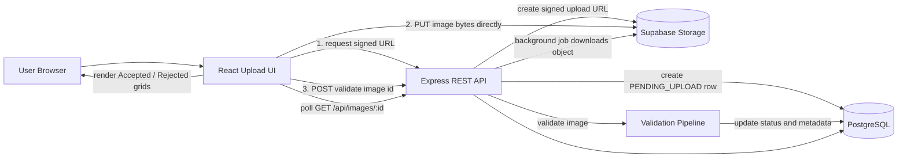
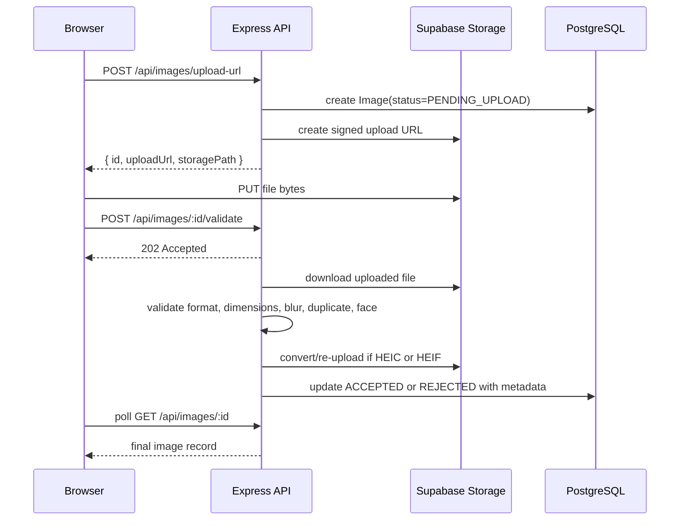

# Aragon AI Image Upload Validation

Full-stack image upload flow for the Aragon.ai Round 1 interview. Users can upload portrait photos, see live progress, and get each image categorized as `ACCEPTED` or `REJECTED` based on image quality and face validation rules.

The implementation is intentionally close to the assignment brief: React on the frontend, Node/Express on the backend, Prisma/PostgreSQL for metadata, Supabase Storage as the S3-compatible storage layer, and an asynchronous validation pipeline for image processing.

## Feature Summary

- Drag-and-drop or file-picker image upload.
- Frontend file validation for JPEG, PNG, HEIC, and HEIF.
- Per-file status feedback: preparing, uploading, validating, accepted, rejected, or failed.
- Local previews while images are uploading.
- Accepted and Rejected image sections with persisted results.
- Rejection labels and tooltips for validation failures.
- Direct-to-storage upload through signed Supabase Storage URLs.
- Background validation with client polling.
- HEIC/HEIF conversion to JPEG before downstream validation.
- Prisma-backed PostgreSQL schema with status and hash indexes.

## Tech Stack

| Area | Technology | Notes |
| --- | --- | --- |
| Frontend | Vite, React, TypeScript | Fast local development and typed UI |
| UI state | React hooks | Local upload state per file |
| Server state | TanStack Query | Fetches accepted/rejected lists and updates cache |
| Styling | Tailwind CSS | Responsive upload interface |
| Backend | Node.js, Express, TypeScript | REST API |
| ORM | Prisma | PostgreSQL schema and typed DB access |
| Database | PostgreSQL, Supabase | Stores image metadata, status, dimensions, hashes |
| Storage | Supabase Storage | S3-equivalent object storage with signed upload URLs |
| Image processing | sharp, heic-convert | Metadata, blur, hash, HEIC conversion |
| Face detection | @vladmandic/face-api, tfjs-node | Single-face, multiple-face, and face-size checks |
| Validation | file-type, Zod | Magic-byte file validation and request validation |

## Architecture



The server does not proxy raw upload bytes during the initial upload. It issues a signed upload URL, the browser uploads directly to Supabase Storage, and the server later downloads the stored object once for validation. This keeps upload memory pressure low on the API process.

## Upload Lifecycle



## Validation Pipeline

The validation logic lives in `server/src/validators`. Results are stored as a `RejectionReason[]` on the image row, so a single image can carry multiple rejection reasons where applicable.

| Requirement | Reason | Implementation |
| --- | --- | --- |
| Reject small files or resolution | `TOO_SMALL` | `sharp(buffer).metadata()` plus file size threshold |
| Reject non-JPG/PNG/HEIC files | `INVALID_FORMAT` | `file-type` magic-byte inspection, not extension trust |
| Reject similar existing images | `DUPLICATE` | 8x8 average hash with Hamming distance threshold |
| Reject blurry images | `BLURRY` | Laplacian variance on a 256x256 grayscale buffer |
| Reject face too small | `FACE_TOO_SMALL` | TinyFaceDetector bounding-box area ratio |
| Reject multiple faces | `MULTIPLE_FACES` | TinyFaceDetector face count |
| Extra guard | `NO_FACE` | Rejects images where no face is detected |
| Extra guard | `PROCESSING_FAILED` | Terminal fallback if validation throws unexpectedly |

Current thresholds:

- Minimum width: `800px`
- Minimum height: `800px`
- Minimum file size: `50 KB`
- Maximum frontend upload size: `15 MB`
- Blur threshold: Laplacian variance `< 200`
- Duplicate threshold: Hamming distance `<= 5`
- Face area threshold: largest face box must be at least `5%` of image area

HEIC and HEIF files are accepted, converted to JPEG with `heic-convert`, re-uploaded to storage, and then validated/stored as JPEG.

## API Overview

Base URL in development: `http://localhost:3000`

### `POST /api/images/upload-url`

Creates a `PENDING_UPLOAD` row and returns a signed object-storage upload URL.

Request:

```json
{
  "filename": "portrait.jpg",
  "mimeType": "image/jpeg"
}
```

Response:

```json
{
  "id": "clx...",
  "storagePath": "uuid.jpg",
  "uploadUrl": "https://..."
}
```

### `PUT <uploadUrl>`

The browser uploads the raw file directly to Supabase Storage. This request bypasses the Express server.

### `POST /api/images/:id/validate`

Starts background validation and returns immediately.

Response:

```json
{
  "id": "clx...",
  "status": "PENDING_UPLOAD"
}
```

### `GET /api/images/:id`

Fetches a single image record. The frontend polls this endpoint until the image is no longer `PENDING_UPLOAD`.

### `GET /api/images?status=ACCEPTED&limit=50&cursor=<id>`

Lists stored images. `status` is optional. Cursor pagination is supported with `limit` capped at 100.

Response:

```json
{
  "items": [
    {
      "id": "clx...",
      "filename": "portrait.jpg",
      "publicUrl": "https://...",
      "status": "REJECTED",
      "rejectionReasons": ["BLURRY"],
      "width": 1200,
      "height": 1600,
      "fileSize": 421000,
      "mimeType": "image/jpeg",
      "createdAt": "2026-05-24T12:00:00.000Z"
    }
  ],
  "nextCursor": null
}
```

### `DELETE /api/images/:id`

Deletes one image row and its storage object.

### `DELETE /api/images`

Bulk deletes image rows and storage objects.

Request:

```json
{
  "ids": ["clx...", "cly..."]
}
```

## Data Model

```prisma
enum ImageStatus {
  PENDING_UPLOAD
  ACCEPTED
  REJECTED
}

enum RejectionReason {
  TOO_SMALL
  INVALID_FORMAT
  DUPLICATE
  BLURRY
  FACE_TOO_SMALL
  MULTIPLE_FACES
  NO_FACE
  PROCESSING_FAILED
}

model Image {
  id               String            @id @default(cuid())
  filename         String
  storagePath      String            @unique
  publicUrl        String
  status           ImageStatus       @default(PENDING_UPLOAD)
  rejectionReasons RejectionReason[]
  fileSize         Int?
  width            Int?
  height           Int?
  mimeType         String?
  pHash            String?
  createdAt        DateTime          @default(now())
  updatedAt        DateTime          @updatedAt

  @@index([status])
  @@index([createdAt(sort: Desc)])
  @@index([pHash])
}
```

The schema is intentionally compact. The UI needs one row per image, and rejection reasons are stored as a PostgreSQL enum array to avoid a join table for this scope.

## Repository Structure

```text
.
|-- client/
|   |-- src/
|   |   |-- components/
|   |   |   |-- AcceptedGrid.tsx
|   |   |   |-- FileListItem.tsx
|   |   |   |-- ImageCard.tsx
|   |   |   |-- RejectedGrid.tsx
|   |   |   |-- SessionGrid.tsx
|   |   |   `-- UploadDropzone.tsx
|   |   |-- lib/
|   |   |   |-- api.ts
|   |   |   `-- rejectionMessages.ts
|   |   |-- pages/
|   |   |   `-- UploadPage.tsx
|   |   `-- types.ts
|   `-- package.json
|-- server/
|   |-- prisma/
|   |   `-- schema.prisma
|   |-- scripts/
|   |   `-- fetch-test-faces.ts
|   |-- src/
|   |   |-- lib/
|   |   |   |-- faceModel.ts
|   |   |   `-- supabase.ts
|   |   |-- routes/
|   |   |   `-- images.ts
|   |   |-- validators/
|   |   |   |-- blur.ts
|   |   |   |-- dimensions.ts
|   |   |   |-- duplicate.ts
|   |   |   |-- face.ts
|   |   |   |-- format.ts
|   |   |   `-- index.ts
|   |   |-- db.ts
|   |   |-- index.ts
|   |   `-- schemas.ts
|   `-- package.json
|-- .env.example
`-- package.json
```

## Local Setup

Prerequisites:

- Node.js 20+
- PostgreSQL database, Supabase recommended for this project
- Supabase Storage bucket

Install dependencies:

```bash
npm install
npm install --prefix client
npm install --prefix server
```

Create environment file:

```bash
cp .env.example .env
```

Fill in all values in `.env`.

```env
DATABASE_URL=postgresql://...
DIRECT_URL=postgresql://...
SUPABASE_URL=https://YOUR_PROJECT_REF.supabase.co
SUPABASE_SERVICE_KEY=your-service-role-key
STORAGE_BUCKET=uploads
PORT=3000
NODE_ENV=development
CLIENT_URL=http://localhost:5173
VITE_API_URL=http://localhost:3000
```

Push the Prisma schema and generate the client:

```bash
npm run db:push --prefix server
npm run db:generate --prefix server
```

Start both apps:

```bash
npm run dev
```

Development URLs:

- Frontend: `http://localhost:5173`
- Backend: `http://localhost:3000`
- Health check: `http://localhost:3000/health`

## Useful Scripts

Root:

```bash
npm run dev
npm run lint
npm run format
```

Client:

```bash
npm run dev --prefix client
npm run build --prefix client
npm run lint --prefix client
```

Server:

```bash
npm run dev --prefix server
npm run build --prefix server
npm run lint --prefix server
npm run db:push --prefix server
npm run db:generate --prefix server
npm run fetch-faces --prefix server -- --count=50
```

## Security Notes

- The original filename is never used as the storage key. Storage paths are generated with `randomUUID()`.
- The frontend blocks unsupported formats, but the backend still performs magic-byte validation.
- The Supabase service-role key is only used server-side.
- Prisma handles parameterized database access.
- CORS is restricted to `CLIENT_URL`.
- The server does not fetch arbitrary user-provided URLs.
- Stale `PENDING_UPLOAD` rows are lazily cleaned up after 30 minutes.

## Performance and Scalability Notes

- Direct browser-to-storage upload avoids buffering upload bodies in Express.
- Validation runs asynchronously after upload, with the client polling for completion.
- `sharp.cache(false)` and low sharp concurrency reduce memory spikes on small instances.
- Validation concurrency is bounded with `p-limit`.
- List queries use cursor pagination with a maximum page size.
- Indexes exist for `status`, `createdAt`, and `pHash`.
- Duplicate comparison checks the latest 1,000 hashes as an MVP trade-off. For production-scale similarity search, this could move to a stronger perceptual hash plus indexed/vectorized lookup strategy.

## Test Plan

Core cases to verify:

| Case | Expected result |
| --- | --- |
| Valid JPEG portrait, one face, large enough | `ACCEPTED` |
| Valid PNG portrait, one face, large enough | `ACCEPTED` |
| Valid HEIC/HEIF portrait | Converted to JPEG, then `ACCEPTED` or `REJECTED` by quality checks |
| BMP/GIF/PDF selected in browser | Rejected before upload |
| Renamed non-image uploaded through API bypass | `REJECTED` with `INVALID_FORMAT` |
| Image under 800x800 or under 50 KB | `REJECTED` with `TOO_SMALL` |
| Duplicate or near-duplicate existing image | `REJECTED` with `DUPLICATE` |
| Blurry image | `REJECTED` with `BLURRY` |
| Face too far from camera | `REJECTED` with `FACE_TOO_SMALL` |
| Group photo | `REJECTED` with `MULTIPLE_FACES` |
| No-face image | `REJECTED` with `NO_FACE` |
| File over 15 MB | Rejected by frontend |
| Network failure while uploading | Upload row is cleaned up and user sees an error |
| Delete image | DB row and storage object are removed |

Sample test assets and a manual test plan can live under `client/public/test-images` during local development. They should not be required for production deployment.

## Trade-offs

- Authentication is intentionally omitted because it was not part of the assignment.
- Polling is used instead of WebSockets/SSE to keep the async flow simple.
- Supabase Storage is used as the S3-equivalent storage service because it pairs naturally with Supabase Postgres and is quick to set up.
- The duplicate detector uses a simple average hash. It is fast and dependency-light, but it is less robust than a full perceptual-hash or embedding-based similarity system.
- Invalid-format uploads are recorded as rejected for user feedback, but no preview is shown for them because the uploaded object is deleted after backend validation.

## Submission Notes

Before sharing the project source, omit generated or local-only folders:

- `node_modules/`
- `client/node_modules/`
- `server/node_modules/`
- `client/dist/`
- `server/dist/`

The important source artifacts are the `client`, `server`, root package files, Prisma schema, README, and environment example.
